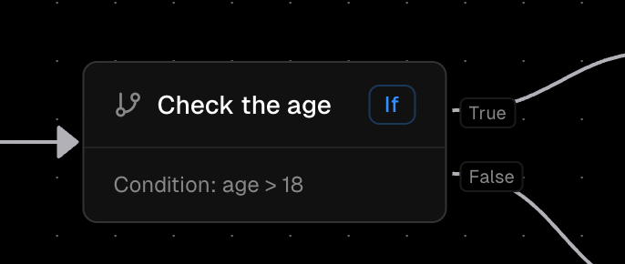

The Condition Node (also called If Node) is a fundamental decision-making component in Orka workflows that enables conditional execution paths based on boolean expressions. It creates branching logic that allows workflows to take different actions depending on whether specified conditions are met.



#### Expression Engine

* **Language:** Go-based expression syntax (expr-lang)
* **Context:** Access to current workflow variables and execution context
* **Evaluation:** Real-time evaluation during workflow execution


### Properties:

*   **Expression**

    The Condition Node's expression field utilizes [Orka Expression Language (OEL)](/core-concepts/OEL) for configuring conditional expressions. OEL provides a powerful way to create logical conditions based on workflow variables and context.

> <mark style="color:$primary;">You can access execution variables within the expression.</mark>

**Operators and Functions**

1. Comparison Operators:

```go
// Numeric comparisons
age >= 18
score > 80
count <= 100
attempts < 3

// String comparisons
status == "active"
role != "admin"
name != ""

// Boolean operations
isEnabled
!isBlocked
hasPermission == true
```

***

2. Logical Operators:&#x20;

```go
// AND operations
isActive && hasPermission
(age >= 18) && (country == "US")

// OR operations
isVIP || orderTotal > 1000
(status == "pending") || (status == "approved")

// NOT operations
!isBlocked
!(attempts >= 3)
```

***

3. Mathematical Operators:

```go
// Arithmetic
total + tax
price * quantity
score / maxScore
attempts % maxAttempts

// Comparison
value >= threshold
count < limit
```

***

4. Built-in Functions

```go
// String functions
len(name) > 0
contains(email, "@")
startsWith(role, "admin")
endsWith(filename, ".txt")

// Numeric functions
abs(score)
min(value1, value2)
max(value1, value2)
round(percentage)

// Array functions
len(items) > 0
contains(items, "item1")
indexOf(items, "item2")

// Map functions
len(properties) > 0
has(properties, "key1")
```

For a complete reference of all available functions and operators, see the [OEL documentation](/core-concepts/OEL).
