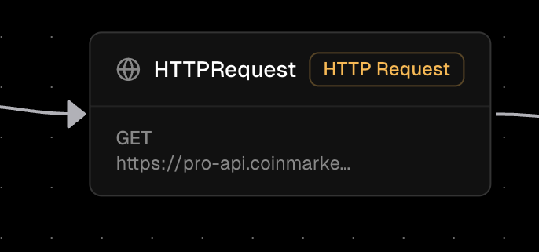

The HTTP Request Node is a powerful integration component in Orka workflows that allows you to make HTTP requests to external APIs, web services, and endpoints. It serves as the primary way to interact with external systems, fetch data, and integrate with third-party services.

### Core Functionality

The HTTP Request Node executes HTTP requests and stores the response data in workflow variables. It can:

* Make GET, POST, PUT, DELETE, and other HTTP requests
* Send data in request bodies and headers
* Handle authentication (Basic, Header-based, Bearer token)
* Process response data and map it to workflow variables
* Only handles RESTful JSON APIs.
* Implement timeout mechanisms

When you use an HTTP Request Node, the response data becomes part of the execution context if you map the response; and is immediately available to all subsequent nodes in your workflow. This creates a powerful integration layer that allows your workflows to interact with external systems and services.

### Properties

*   **Method**

    The HTTP method to use for the request. Supported methods include:

    * GET
    * POST
    * PUT
    * DELETE
    * PATCH
    * HEAD
    * OPTIONS

*   **URL**

    The target URL for the HTTP request. This can include:

    * Full URLs with protocol `(https://api.example.com/endpoint)`
    * Path parameters `(/users/{{userId}}/profile)`
    * Query parameters `(?page=1&limit=10)`
    * Variable interpolation using `{{variableName}}` syntax

*   **Headers**

    HTTP headers to include with the request. Common headers include:

    * Custom headers: Any additional headers needed

*   **Body**

    The request body data to send with the request. This can include:

    * JSON data: Structured data in JSON format
    * Form data: Key-value pairs for form submissions
    * Raw text: Plain text or XML content
    * Variable interpolation: Use `{{variableName}}` to include workflow variables

*   **Send Body**

    Boolean flag indicating whether to include a request body. Set to:

    * **true**: Include the request body
    * **false**: Send request without body

*   **Auth**

    Authentication configuration for the request. Supported types:

    * **none**: No authentication required
    * **basic**: Username and password authentication
    * **header**: Custom header-based authentication
    * **bearer**: Bearer token authentication

*   **Response Mapping**

    Configuration for mapping response data to workflow variables. This allows you to:

    * Extract specific fields from the response
    * Store the entire response in a variable
    * Transform response data before storing
    * Handle different response structures

> You can use `$` to map the whole response body to the execution variables.
> 

*   **Timeout**

    Maximum time to wait for the response in milliseconds. This prevents the request from hanging indefinitely and ensures your workflow continues execution.
