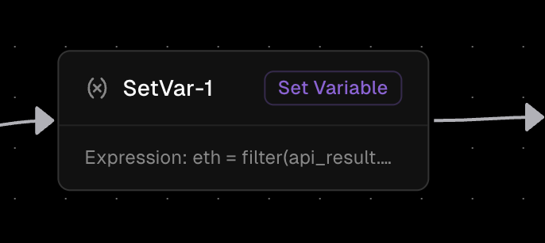

Evaluates assignment expressions and stores results as workflow variables.

## Core Functionality
- Create/update variables
- Do calculations
- Transform data
- Values become available to subsequent nodes immediately

## Properties
- **Expression** — uses [Orka Expression Language (OEL)](/core-concepts/OEL), a Go-based expression language for creating and manipulating variables

### Example
```go
age = 25
name = "John"
isActive = true
```

For more examples and detailed syntax information, see the [OEL documentation](/core-concepts/OEL).
