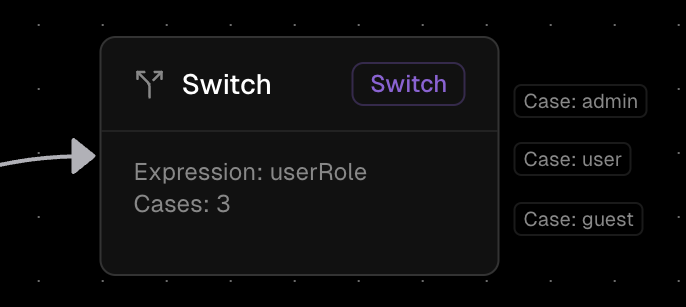

# Switch Node

The Switch Node is a multi-path routing component in Orka workflows that enables conditional execution based on variable values. Unlike the If Node which has only two paths (true/false), the Switch Node can route workflow execution to multiple different paths based on matching specific values or conditions.

### Properties

*   **Switch Expression**

    The variable or calculation that gets evaluated using [Orka Expression Language (OEL)](/core-concepts/OEL)
*   **Data Type**

    The Expression's final calculated values' data type

    Possible types:

    * String
    * Number
*   **Clauses**

    The possible values to match against, each corresponding to a specific execution path

