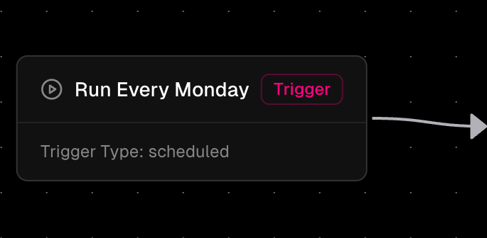
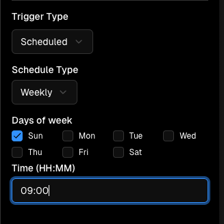
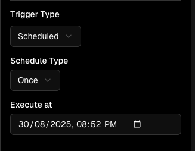

The Trigger Node is the fundamental starting point of every workflow in Orka. It defines how and when a workflow is initiated, serving as the entry point that determines the execution context and scheduling behavior.

## What is a Trigger Node?

A Trigger Node is a special workflow component that:

* Always appears first in workflow definitions
* Defines the execution method (manual, form-based, or scheduled)

***

## Trigger Types

### 1. Manual Trigger

The simplest trigger type that allows workflows to be executed on-demand.

### 2. Form Trigger

Executes workflows when a form is submitted, with form data automatically available as workflow variables.

Form triggers connect your workflows directly to form submissions, enabling automated processing of user-submitted data. When a user submits a form, the workflow is triggered automatically and all form fields become available as variables in your workflow.

**Key features:**
- Each form field is accessible as a variable using the field's ID
- File uploads are handled as file references
- Form metadata (submission time, user info) is included
- Multiple workflows can be triggered by the same form

For more information on creating and managing forms, see the [Forms documentation](/core-concepts/FORMS).

### 3. Scheduled Trigger

Advanced trigger type that enables automated, time-based workflow execution.

#### **Schedule Types**

1. **Interval Schedule:**

   Executes workflows at regular time intervals.

   _**Supported Units:**_
   
   _seconds - Execute every X seconds_
   
   _minutes - Execute every X minutes_
   
   _hours - Execute every X hours_
   
   _days - Execute every X days_

2. **Weekly Schedule:**

   Executes workflows on specific days of the week at a designated time.
   
   _**Example:** Weekly every Monday at 9 AM._

   

3. **One-Time Schedule:**

   Executes a workflow once at a specific date and time.
   
   _**Example:** Once on 30th of August 2025 at 08:52 PM._

   

4. **Cron Schedule:**

   Executes workflows using standard cron expressions for complex scheduling patterns.
   
   _**Example:**_ **`0 0 1 * *`** _: First day of each month_
