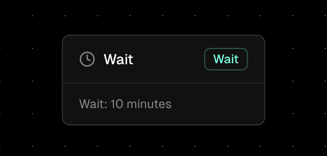

The Wait Node is a timing control component in Orka workflows that allows you to pause workflow execution for a specified duration. It's essential for creating time-based workflows, implementing delays, and managing execution timing in automated processes.

### Core Functionality

The Wait Node pauses workflow execution for a specified amount of time before continuing to the next node. It can:

* Delay execution for precise time periods
* Create time-based workflow sequences
* Implement retry mechanisms with delays
* Synchronize workflow timing with external events
* Manage rate limiting and throttling

When you use a Wait Node, the workflow execution pauses for the specified duration while preserving all workflow variables and execution context. After the wait period completes, execution continues seamlessly to the next connected node, maintaining the complete workflow state.

### Properties

*   **Unit**

    The time unit for the wait duration. Supported units are:

    * _second: Wait in seconds (1, 5, 30, 60)_
    * _minute: Wait in minutes (1, 5, 15, 60)_
    * _hour: Wait in hours (1, 2, 6, 12, 24)_
*   **Value**

    The numeric value representing the wait duration in the specified unit. This must be a positive integer.

***

### Important: Execution Duration Quota

⚠️ **Critical Limitation:** Since there is a quota for execution duration, keep in mind that if the wait exceeds the execution duration quota, the execution will fail. When this happens, an error will be displayed in the executions details page explaining what went wrong.

_**Example**_: If your plan has a 10-minute execution duration limit and you set a Wait Node to wait for 15 minutes, the workflow will fail with an error indicating that the execution duration quota was exceeded.

_**Best Practice**_: Always ensure your Wait Node duration is well within your plan's execution duration limits to avoid workflow failures.
