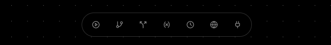
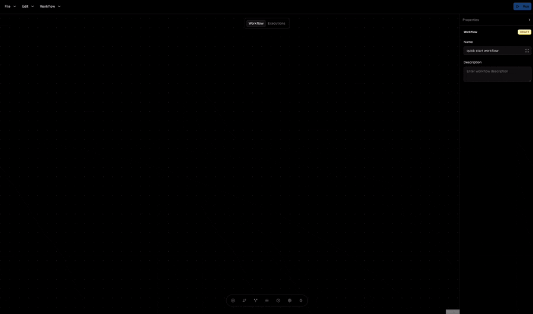
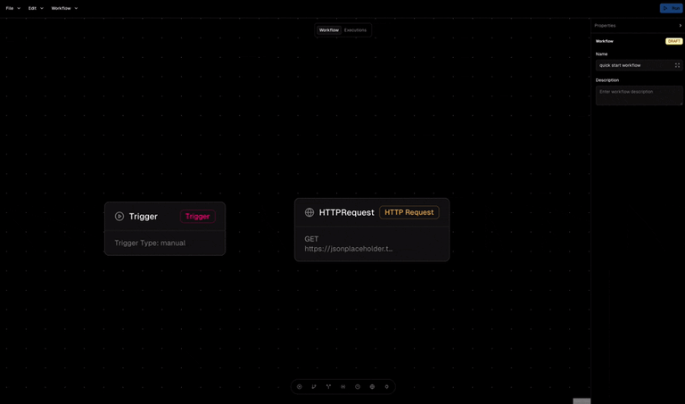
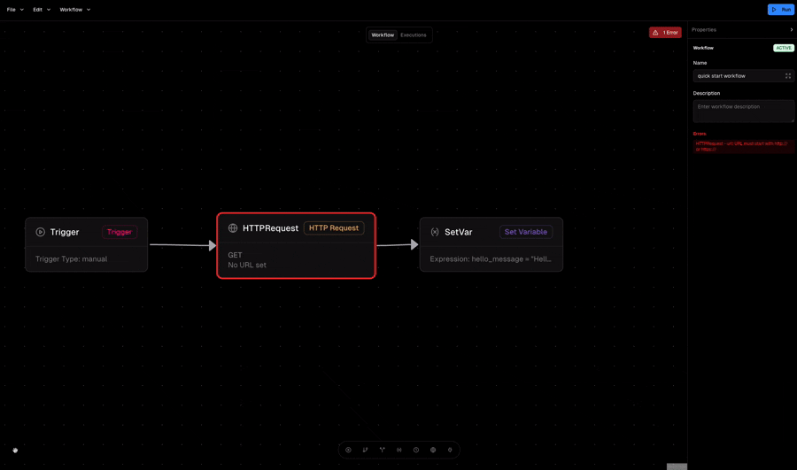

## Sign Up & Access

1. Visit [sign-up](https://orka.build/auth/sign-up) page.
2. Fill out the form and complete your account setup.

***

## Create Your First Workflow

1. Once you are logged in, you can see the "Create Workflow" button. By clicking on it, you can create a new workflow.
2. Once you choose a name for your workflow, you will be redirected to the workflow builder page.
3. At the bottom of the page, you’ll find the nodes dock, where you can create different types of steps by clicking on them.



From left to right, the steps are:

1. [Trigger Node](/core-concepts/node-types/TRIGGER_NODE)
2. [Condition Node](/core-concepts/node-types/CONDITION_NODE)
3. [Switch Node](/core-concepts/node-types/SWITCH_NODE)
4. [Set Variable Node](/core-concepts/node-types/SET_VARIABLE_NODE)
5. [Wait Node](/core-concepts/node-types/WAIT_NODE)
6. [HTTP Request Node](/core-concepts/node-types/HTTP_REQUEST_NODE)

The last one is for adding plugins to the workflow, which we’ll cover later.

### Design the workflow

Let’s build a simple workflow to help you understand how Orka works.\
As mentioned earlier, every workflow in Orka starts with a trigger. To begin, drag and drop (or click) the leftmost icon in the node dock—the Trigger Node. Once the Trigger Node appears on the canvas, click on it to open the properties panel on the right. The properties panel allows you to configure the settings of the selected node.



For the second node, let’s add an HTTP Request Node. This node allows you to send HTTP requests and interact with external systems. For now, we’ll use a mock API to demonstrate its functionality.

To add it, select the second icon from the right in the node dock.

Now, configure its properties as follows:

* **URL**: `https://jsonplaceholder.typicode.com/users/1`
  * You can try the API, here is the response body:
  * ```json
    {
      "id": 1,
      "name": "Leanne Graham",
      "username": "Bret",
      "email": "Sincere@april.biz",
      "address": {
        "street": "Kulas Light",
        "suite": "Apt. 556",
        "city": "Gwenborough",
        "zipcode": "92998-3874",
        "geo": {
          "lat": "-37.3159",
          "lng": "81.1496"
        }
      },
      "phone": "1-770-736-8031 x56442",
      "website": "hildegard.org",
      "company": {
        "name": "Romaguera-Crona",
        "catchPhrase": "Multi-layered client-server neural-net",
        "bs": "harness real-time e-markets"
      }
    }
    ```
* **Method**: `GET`
* Response Mapping:
  * Click on add mapping and map `user_name` to `name`.  This will extract the `name` field in the API response body and map it to a execution variable called `user_name`.

Next, connect the Trigger Node to the HTTP Request Node by creating a link between them, as shown in the following video:



As the third node, let's add a [Set Variable Node](/core-concepts/node-types/SET_VARIABLE_NODE) as the third node. Click on the added node and in the expression field enter the following expression:

```go
hello_message = "Hello dear {{user_name}}"
```

Then, connect the HTTP Request node to the Set Variable node which is the last node in our workflow.

Now we have a simple workflow that:

1. Sends a request to an API to fetch a user information in JSON
2. Extract a field in the response body called `name` and map it to `user_name`.
3. Declares a new variable for greeting the user appending the user's name to the end of the message.

After completing the configuration, go to the main menu and select **File > Save** to store the workflow we just designed. If you see an error after clicking **Save**, it means something in your configuration is incorrect. If there’s an issue, an error box will usually appear in the top-right corner of the canvas, explaining what went wrong.

<Callout type="warning">
If you don't save the workflow, it will be lost when you close or leave the Orka tab in your browser.
</Callout>



### Running the workflow

Now it's time to run our workflow! For running a workflow you should always deploy it.

Use the **Menu > Workflow > Deploy (Activate)** to deploy the workflow. Once deployed, the **Run** button (located in the top-right corner of the page) will become enabled. Clicking this button will trigger the execution of your workflow.

After running it, switch to the **Executions** tab to view the list of executions for the current workflow. Then click on the only record in the executions list, you will be redirected to **Execution Details** page.

At the bottom-left of the page, you can view the execution variables as follows:


As you can see, the `{{user_name}}` in the Set Variable expression has been evaluated and replaced with the actual name of the user in the `hello_message`. This demonstrates how execution variables work in Orka.

### Execution Variables

Execution variables are dynamic values that are generated or passed along during the execution of a workflow. Once a variable is created—such as `user_name` extracted from the HTTP response—you can reference it in other nodes by wrapping it in double curly braces, like `{{variable_name}}`.

For example:

* If the API response returned a user with the name `John`, the expression `Hello, {{user_name}}!` would evaluate to **“Hello, John!”**.
* If instead the API returned `Sara`, the same expression would automatically become **“Hello, Sara!”**.

This makes your workflows flexible and reusable. You don’t have to hard-code values; instead, you can extract them from responses, set them as variables, and use them anywhere else in the workflow.

Typical places where execution variables can be used include:

* **Set Variable nodes** – to build custom messages or compute new values.
* **HTTP Request nodes** – e.g., calling an API with a dynamic parameter like `https://api.example.com/users/{{user_id}}`.

### Execution Route


At the bottom-right of the page, you can see the _execution route_. This panel shows important details such as which path in the workflow was executed, when the execution started, and how long it took.

This feature is especially useful when your workflow contains different branches—for example, when you use Condition or Switch nodes. In such cases, the execution route helps you understand exactly which branch was taken during a specific run.

In addition to the panel, the workflow canvas itself provides a visual cue: the path that was executed is highlighted with a blue connection. This makes it easy to follow the flow of data step by step and verify that your workflow is behaving as expected.


This was just a simple example to show you the basics of Orka. From here, you can explore more advanced features, unlock additional functionality by using plugins, and build more powerful workflows.